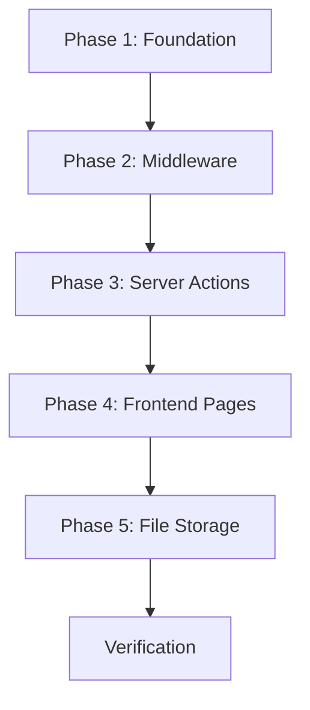

# Implementation Plan: Next-Gen LMS (Aligning Codebase with PRD)

## Goal Description

Upgrade the existing codebase to fully comply with the [PRD](file:///d:/laragon/www/aiedu/docs/prd.md). The current project has a solid foundation (Next.js 15, Tailwind, Better Auth, Drizzle ORM) but has critical gaps:

| Area | Current State | PRD Requirement |
|---|---|---|
| Data layer | Zustand mock store (`useStore.ts`) | Neon PostgreSQL via Server Actions |
| DB driver | `pg` Pool (`drizzle-orm/node-postgres`) | `@neondatabase/serverless` (`drizzle-orm/neon-http`) |
| Roles | Hardcoded email matching (`auth-role.ts`) | `role` enum column on `user` table |
| AI provider | `@google/genai` (Gemini) | OpenRouter.ai (OpenAI-compatible SDK) |
| UI library | Tailwind + custom classes (`app-card`, `app-btn-primary`, etc.) | Tailwind CSS + **Shadcn UI** |
| Route protection | Client-side redirect in layouts | Next.js **Middleware** + server-side checks |
| Schema | 4 simplified tables | 8 full tables with relations |
| File storage | None | File upload for materials & submissions |

---

## Notices

> [!WARNING]
> **Database Reset Required** — Schema changes require new Drizzle migrations. Existing tables will be restructured.

> [!IMPORTANT]
> **Shadcn UI** — Initialize Shadcn UI (`npx shadcn@latest init`) and adopt the built-in **Sidebar** component as the dashboard layout scaffold, replacing the custom `app-shell.tsx`. This provides collapsible sidebar, mobile responsive sheet drawer, grouped menu sections, and icon-only mode out of the box.

---

## Phase 1: Foundation (Dependencies, DB, Auth)

### 1.1 Dependency Changes

#### [MODIFY] [package.json](file:///d:/laragon/www/aiedu/package.json)

**Install:**
```bash
npm install @neondatabase/serverless openai
npx shadcn@latest init
```

**Remove:**
```bash
npm uninstall @google/genai pg
```

> [!NOTE]
> Keep `@hookform/resolvers`, `react-hook-form` in mind — install if not present, these are needed for Shadcn form components.

**New env vars needed in `.env.local` and `.env.example`:**
```env
OPENROUTER_API_KEY="sk-or-..."
OPENROUTER_MODEL="anthropic/claude-3.5-sonnet"   # or any preferred model on OpenRouter

# Remove no-longer-needed:
# GEMINI_API_KEY  ← delete this
# NEXT_PUBLIC_GEMINI_API_KEY  ← delete this
# NEXT_PUBLIC_ADMIN_EMAILS  ← delete this (role now from DB)
# NEXT_PUBLIC_TEACHER_EMAILS  ← delete this (role now from DB)
```

#### [MODIFY] [.env.example](file:///d:/laragon/www/aiedu/.env.example)
- Remove `GEMINI_API_KEY`, `ADMIN_EMAILS`, `TEACHER_EMAILS` and related `NEXT_PUBLIC_*` vars.
- Add `OPENROUTER_API_KEY` and `OPENROUTER_MODEL`.

---

### 1.2 Database Driver

#### [MODIFY] [db.ts](file:///d:/laragon/www/aiedu/lib/db.ts)
- Replace `drizzle-orm/node-postgres` + `pg` with `@neondatabase/serverless` + `drizzle-orm/neon-http`.
- Pass **all schemas** (auth + app) to `drizzle()` so `db.query.*` relational API works.

```typescript
// NEW lib/db.ts
import { neon } from "@neondatabase/serverless";
import { drizzle } from "drizzle-orm/neon-http";
import * as authSchema from "./auth-schema";
import * as schema from "./schema";

const sql = neon(process.env.DATABASE_URL!);
export const db = drizzle(sql, { schema: { ...authSchema, ...schema } });
export type DB = typeof db;
```

---

### 1.3 Auth Schema — Role Enum

#### [MODIFY] [auth-schema.ts](file:///d:/laragon/www/aiedu/lib/auth-schema.ts)
- Export `roleEnum` using `pgEnum("role", ["ADMIN", "TEACHER", "STUDENT"])` **before all table definitions** (it's referenced by both `user` and `enrollments`).
- Add `role: roleEnum("role").default("STUDENT").notNull()` on the `user` table.
- Keep existing Better Auth tables (`session`, `account`, `verification`) untouched.

> [!IMPORTANT]
> The `roleEnum` must be exported from `auth-schema.ts` (not `schema.ts`) because the `enrollments.roleInClass` column in `schema.ts` imports it. This prevents circular dependency.

---

### 1.4 Auth Config — Admin Plugin

#### [MODIFY] [auth.ts](file:///d:/laragon/www/aiedu/lib/auth.ts)
- Add `user.additionalFields.role` so Better Auth exposes it in session tokens.
- Add the Better Auth **Admin Plugin**.

```typescript
import { admin } from "better-auth/plugins";

export const auth = betterAuth({
  // ...existing config...
  user: {
    additionalFields: {
      role: {
        type: ["ADMIN", "TEACHER", "STUDENT"],
        defaultValue: "STUDENT",
        input: false, // users cannot self-assign roles
      },
    },
  },
  plugins: [nextCookies(), admin({ defaultRole: "STUDENT" })],
});
```

**After changing `auth.ts`**, regenerate the Better Auth schema:
```bash
npm run auth:generate
npm run auth:migrate
```

#### [MODIFY] [auth-client.ts](file:///d:/laragon/www/aiedu/lib/auth-client.ts)
- Add `adminClient()` plugin so role management APIs are available client-side.

```typescript
import { createAuthClient } from "better-auth/react";
import { adminClient } from "better-auth/client/plugins";

export const authClient = createAuthClient({
  baseURL: process.env.NEXT_PUBLIC_BETTER_AUTH_URL,
  plugins: [adminClient()],
});
```

#### [DELETE] [auth-role.ts](file:///d:/laragon/www/aiedu/lib/auth-role.ts)
- No longer needed. Remove all imports of this file from layouts and pages.

---

### 1.5 Application Schema

#### [MODIFY] [schema.ts](file:///d:/laragon/www/aiedu/lib/schema.ts)

Replace the 4 existing simplified tables with the **7 tables from the PRD** plus **Drizzle `relations()`**:

| Table | Key Columns | Notes |
|---|---|---|
| `classes` | id (uuid/defaultRandom), name, description, academicYear, createdAt | |
| `enrollments` | id, userId (→ user.id), classId (→ classes.id), roleInClass (roleEnum) | Many-to-many pivot |
| `materials` | id, classId, title, content, fileUrl, scheduledAt, createdAt | `scheduledAt` gates student access |
| `assignments` | id, materialId, title, instructions, dueDate, aiPromptContext | `aiPromptContext` → AI grader prompt |
| `submissions` | id, assignmentId, studentId, answerText, fileUrl, aiFeedback, aiScore, finalGrade, gradedAt, status | status: pending/graded/revision |
| `chatMessages` | id, userId, classId, role ('user'/'assistant'), content, createdAt | Persists AI Tutor history |
| `materialEmbeddings` | id, materialId, chunkContent | RAG chunks; vector column optional |

**Required `relations()` definitions** (enables `db.query.*` relational API):
```typescript
import { relations } from "drizzle-orm";

// classes → many enrollments, many materials
export const classesRelations = relations(classes, ({ many }) => ({
  enrollments: many(enrollments),
  materials: many(materials),
}));

// enrollments → one user, one class
export const enrollmentsRelations = relations(enrollments, ({ one }) => ({
  user: one(user, { fields: [enrollments.userId], references: [user.id] }),
  class: one(classes, { fields: [enrollments.classId], references: [classes.id] }),
}));

// materials → one class, many assignments, many embeddings
export const materialsRelations = relations(materials, ({ one, many }) => ({
  class: one(classes, { fields: [materials.classId], references: [classes.id] }),
  assignments: many(assignments),
  embeddings: many(materialEmbeddings),
}));

// assignments → one material, many submissions
export const assignmentsRelations = relations(assignments, ({ one, many }) => ({
  material: one(materials, { fields: [assignments.materialId], references: [materials.id] }),
  submissions: many(submissions),
}));

// submissions → one assignment, one student
export const submissionsRelations = relations(submissions, ({ one }) => ({
  assignment: one(assignments, { fields: [submissions.assignmentId], references: [assignments.id] }),
  student: one(user, { fields: [submissions.studentId], references: [user.id] }),
}));
```

#### [MODIFY] [drizzle.config.ts](file:///d:/laragon/www/aiedu/drizzle.config.ts)
- Confirm schema array includes both `./lib/auth-schema.ts` and `./lib/schema.ts` (already correct, verify after changes).

---

### 1.6 Migrations & Seed

```bash
npm run db:generate   # Generate SQL migration files
npm run db:migrate    # Apply to Neon database
```

> [!CAUTION]
> If existing tables conflict, you may need to manually drop old tables before migrating, or add a `--force` flag. Back up any existing data first.

#### [MODIFY] [seed-users.ts](file:///d:/laragon/www/aiedu/scripts/seed-users.ts)
- Update to create users with explicit `role` values (must set via direct DB insert or `auth.api.setRole` after signup).
- Seed a demo class, enrollment, and at least one scheduled material for testing visibility logic.

---

### 1.7 Shadcn UI Init

Initialize Shadcn UI for the project:
```bash
npx shadcn@latest init
```
Select: **TypeScript**, **Next.js App Router**, default style (New York or Default), and CSS variables.

Then add the components needed across all phases:
```bash
npx shadcn@latest add sidebar button input card dialog select table tabs badge textarea dropdown-menu toast avatar form label separator skeleton
```

---

## Phase 2: Middleware & Route Protection

### 2.1 Next.js Middleware

#### [NEW] [middleware.ts](file:///d:/laragon/www/aiedu/middleware.ts)

The PRD requires server-side route protection (Section 6 — Security). Create `middleware.ts` at the root of the project:

```typescript
import { NextRequest, NextResponse } from "next/server";
import { auth } from "@/lib/auth";

const ROLE_ROUTES: Record<string, string> = {
  "/admin": "ADMIN",
  "/teacher": "TEACHER",
  "/student": "STUDENT",
};

export async function middleware(request: NextRequest) {
  const { pathname } = request.nextUrl;

  // Find which role is required for this path
  const requiredRole = Object.entries(ROLE_ROUTES).find(([prefix]) =>
    pathname.startsWith(prefix)
  )?.[1];

  if (!requiredRole) return NextResponse.next(); // public route

  // Read session from Better Auth
  const session = await auth.api.getSession({
    headers: request.headers,
  });

  // No session → redirect to login
  if (!session?.user) {
    return NextResponse.redirect(new URL("/", request.url));
  }

  const userRole = (session.user as { role?: string }).role;

  // Wrong role → redirect to own dashboard
  if (userRole !== requiredRole) {
    const dashboardMap: Record<string, string> = {
      ADMIN: "/admin/dashboard",
      TEACHER: "/teacher/dashboard",
      STUDENT: "/student/dashboard",
    };
    const redirect = dashboardMap[userRole ?? "STUDENT"] ?? "/";
    return NextResponse.redirect(new URL(redirect, request.url));
  }

  return NextResponse.next();
}

export const config = {
  matcher: ["/admin/:path*", "/teacher/:path*", "/student/:path*"],
};
```

---

### 2.2 Layout Cleanup

#### [MODIFY] `app/admin/layout.tsx`, `app/teacher/layout.tsx`, `app/student/layout.tsx`
- **Remove** the `useEffect`-based role check and redirect logic from all layout files — middleware now handles this server-side.
- Keep session-loading for displaying user name/avatar in the UI.

---

## Phase 3: Server Actions (Data Layer)

#### [DELETE] [useStore.ts](file:///d:/laragon/www/aiedu/store/useStore.ts)
- Remove all mock data. Retain only purely client-side UI state if any remains.

### 3.1 Admin Actions

#### [NEW] `app/actions/users.ts`
- `getUsers(role?)` — list/filter users
- `createUser(data)` — create with role assignment
- `updateUser(id, data)` — update profile/role
- `deleteUser(id)` — soft or hard delete

#### [NEW] `app/actions/classes.ts`
- `getClasses()` — list all classes (admin) or enrolled classes (teacher/student)
- `createClass(data)` — create class with `academicYear`
- `updateClass(id, data)` — update
- `deleteClass(id)` — delete (cascade enrollments)

#### [NEW] `app/actions/enrollments.ts`
- `enrollUsers(classId, userIds[], role)` — bulk assign students/teachers
- `removeEnrollment(classId, userId)` — remove from class
- `getClassEnrollments(classId)` — list members

### 3.2 Teacher Actions

#### [NEW] `app/actions/materials.ts`
- `getMaterials(classId)` — with schedule filter for students
- `createMaterial(data)` — including `fileUrl` and `scheduledAt`
- `updateMaterial(id, data)` / `deleteMaterial(id)`

#### [NEW] `app/actions/assignments.ts`
- `getAssignments(classId | materialId)` — list assignments
- `createAssignment(data)` — with `dueDate` and `aiPromptContext`
- `getSubmissions(assignmentId)` — list all student submissions
- `overrideGrade(submissionId, finalGrade)` — teacher review/override

### 3.3 Student Actions

#### [NEW] `app/actions/submissions.ts`
- `submitAssignment(assignmentId, { answerText, fileUrl })` — student submits work
- `getMySubmissions(studentId)` — student view of their submissions

### 3.4 AI Actions

#### [NEW] `lib/ai.ts`

OpenRouter client using the **OpenAI SDK** with a custom `baseURL`:

```typescript
import OpenAI from "openai";

export const openrouter = new OpenAI({
  baseURL: "https://openrouter.ai/api/v1",
  apiKey: process.env.OPENROUTER_API_KEY,
});
```

#### [NEW] `app/actions/ai.ts`
- **`gradeSubmission(submissionId)`** — Sends `answerText` + `aiPromptContext` to OpenRouter, saves `aiFeedback` + `aiScore` to `submissions`.
- **`generateQuestions(materialId)`** — AI Content Creator: generates MC/essay drafts from material content.
- **`summarizeMaterial(materialId)`** — AI Summary Tool: generates a summary for quick student review.
- **`chatWithTutor(classId, userId, message)`** — RAG Chatbot: loads class materials as context, sends to OpenRouter, saves to `chatMessages`.

---

## Phase 4: Frontend Pages

### 4.1 Admin Module Pages

#### [MODIFY] [admin/dashboard](file:///d:/laragon/www/aiedu/app/admin/dashboard/page.tsx)
- Fetch real stats via server actions (total users, classes, submissions).

#### [MODIFY] [admin/students](file:///d:/laragon/www/aiedu/app/admin/students/page.tsx)
- **Full User Management CRUD** (not just students — all user roles).
- Rename route to `/admin/users` or keep `/admin/students` but handle all roles.

#### [MODIFY] [admin/classes](file:///d:/laragon/www/aiedu/app/admin/classes/page.tsx)
- **Class Management**: create/edit/delete classes with `academicYear`.
- **Enrollment UI**: assign students and teachers to classes.

#### [MODIFY] [admin/materials](file:///d:/laragon/www/aiedu/app/admin/materials/page.tsx)
- **Scheduling UI**: set `scheduledAt` for when materials become accessible.

#### Update `admin/layout.tsx` nav items to reflect new pages.

---

### 4.2 Teacher Module Pages

#### [MODIFY] [teacher/dashboard](file:///d:/laragon/www/aiedu/app/teacher/dashboard/page.tsx)
- Show teacher's enrolled classes, pending submissions to review, recent AI grading results.

#### [MODIFY] [teacher/classes](file:///d:/laragon/www/aiedu/app/teacher/classes/page.tsx)
- View materials & assignments per class.

#### [NEW] `app/teacher/materials/page.tsx`
- **Material Management CRUD** (Text, PDF upload, Video link).
- **AI Content Creator button**: generate questions from material via `generateQuestions()`.

#### [NEW] `app/teacher/assignments/page.tsx`
- Create assignments with `dueDate` and `aiPromptContext`.
- View submissions list per assignment.
- **AI Assessment panel**: view AI score/feedback, override with `finalGrade`.

#### [MODIFY] [teacher/students](file:///d:/laragon/www/aiedu/app/teacher/students/page.tsx)
- View students enrolled in teacher's classes.

#### Update `teacher/layout.tsx` nav items.

---

### 4.3 Student Module Pages

#### [MODIFY] [student/dashboard](file:///d:/laragon/www/aiedu/app/student/dashboard/page.tsx)
- Show enrolled classes with **learning progress** (completed/total assignments).

#### [MODIFY] [student/materials](file:///d:/laragon/www/aiedu/app/student/materials/page.tsx)
- Only show materials where `scheduledAt <= now()`.
- Show AI-generated summaries if available.

#### [MODIFY] [student/assignments](file:///d:/laragon/www/aiedu/app/student/assignments/page.tsx)
- **Assessment Interface**: take quizzes / submit text answers.
- **File Upload**: upload documents with file type validation.
- View grades and AI feedback after grading.

#### [MODIFY] [student/chat](file:///d:/laragon/www/aiedu/app/student/chat/page.tsx)
- Replace Google GenAI with OpenRouter.
- Scope chat context to the selected class's materials only (RAG).
- Save/load conversation history from `chatMessages` table.

#### Update `student/layout.tsx` nav items.

---

### 4.4 Shared Components

#### [DELETE] [app-shell.tsx](file:///d:/laragon/www/aiedu/app/components/app-shell.tsx)
- Replace entirely with the Shadcn UI **Sidebar** scaffold.

#### [NEW] Dashboard Layout Scaffold (Shadcn Sidebar)

Use the built-in Shadcn **Sidebar** component as the scaffold for all dashboard layouts. Structure:

```
SidebarProvider
├── AppSidebar (per role: admin/teacher/student)
│   ├── SidebarHeader        → Logo + brand name
│   ├── SidebarContent       → Scrollable nav groups
│   │   ├── SidebarGroup     → Main navigation (Dashboard, Classes, etc.)
│   │   └── SidebarGroup     → Secondary (Settings, Help)
│   └── SidebarFooter        → User avatar + logout
├── main
│   ├── SidebarTrigger       → Toggle button (hamburger)
│   └── {children}           → Page content
```

Add the Sidebar component plus other Shadcn components:
```bash
npx shadcn@latest add sidebar button input card dialog select table
npx shadcn@latest add tabs badge textarea dropdown-menu toast avatar
```

This provides:
- **Collapsible sidebar** (full ↔ icon-only mode)
- **Mobile responsive** (Sheet drawer on small screens)
- **Grouped menus** with collapsible sections
- **Consistent theming** across all role dashboards

#### [NEW] `app/components/file-upload.tsx`
- Reusable file upload component for materials (PDF/Doc) and submissions.
- File type validation as required by PRD Section 3.3.

---

## Phase 5: File Storage

#### [NEW] `app/api/upload/route.ts`
- API route to handle file uploads (materials PDF/Doc, student submission files).
- Store in `public/uploads/` or configure external storage (S3/Cloudflare R2) based on preference.
- Return the `fileUrl` to save in materials/submissions tables.

---

## Verification Plan

### Automated Checks
```bash
npx tsc --noEmit          # Type safety
npm run lint              # Linting
npm run db:generate       # Schema generation
npm run db:migrate        # Migration execution
npm run build             # Full build verification
```

### Functional Testing Matrix

| Scenario | Steps | Expected |
|---|---|---|
| Default role | Sign up new user | Role = STUDENT |
| Admin access | Set role to ADMIN in DB → login | Access `/admin/dashboard` |
| Route protection | Student visits `/admin/*` | Redirected to `/` |
| Class CRUD | Admin creates class + enrolls users | Visible in teacher/student dashboards |
| Material scheduling | Teacher creates material with future `scheduledAt` | Student cannot see until scheduled time |
| File upload | Teacher uploads PDF material | File saved, `fileUrl` stored |
| Assignment flow | Teacher creates → Student submits → AI grades → Teacher overrides | Full lifecycle works |
| AI Chatbot | Student asks question in chat | OpenRouter responds with class-scoped context |
| AI Summary | Student requests material summary | Summary generated and displayed |
| AI Content Creator | Teacher generates questions from material | MC/Essay draft generated |

---

## Implementation Order (Recommended)



Each phase can be implemented and tested incrementally. Phase 1 must be completed first as all other phases depend on the new schema and auth setup.
